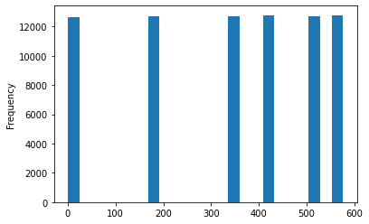

# Idea

1. 기존 유저들을 대상으로 새로운 portfolio를 날린다. 그래서 그 사람들이 클릭해볼지 맞추는게 목표이다

f(user, click) = true or false


## Data Understanding

한 유저는 여러번 received, viewed, completed 가 발생가능하다

- 어떠한 porfolio를 한번도 받지않은 유저는 6명이 있다. 이들은 거른다
- 그 6명 외에는 received를 한번도 받지 않은 사람은 없다
- 유저는 동일한 portfolio를 여러번 받기도 한다.
- view 없이 complete가 가능하다

- offer는 bogo, informational, discount 3종류가 있다
- 이중 bogo, discount 는 complete가 가능하지만 informational은 complete가 없다, viewed는 세 종류 다 있다
- offer_received는 특정 시간대에만 주어졌다. 따라서 이를 바탕으로 train-test 셋을 나눌 수 있다([  0, 168, 336, 408, 504, 576])




같은 offer를 여러 번 받거나 여러번 클릭한 경우가 있다. 이 경우엔 어떻게?
문제를 단순화하기 위해서 여러번 받는 경우는 고려하지 않도록 한다.
이 경우 여러번 받았는데 한번은 안 봤을 수도 있지만, 그런 사례는 우선 생략하자


기본 클릭율이 75%나 되기 때문에 정답을 맞추기 어렵다.

### Train-Test Split
Train: 
- time between 0 ~ 503

Test
- time between 504 ~ 576

train set에서도 receive를 받았던 person이고, test set에서도 receive를 아무거나 받았던 person
확인결과 모든 person이 해당한다.굿 ㅎ


## 1. 학습되지 않은 유저를 대상으로 predict: 

### Prepartion
table

person, offer_received, offer_viewed, offer_completed, reward

```
f(portfolio, user_info) = true or false
```


## 2. 학습된 유저를 대상으로 predict


user = f(user_id) + user_info
event = f(event_id) + event_info

~ train
f(user, event) = true or false

~ test
f(user, new_event) = true or false


# 개선 아이디어
1. 어떤 데이터를 주로 못맞출까?
1. 어던 데이터를 잘 맞출까?
1. 어디를 개선해야할까...

transaction 이 없었을 때는
test 81% 수준
```
Report for xgb
Train Report>
Train Accuracy: 0.8528484848484849
              precision    recall  f1-score   support

         0.0       0.73      0.58      0.65     10469
         1.0       0.88      0.93      0.91     34906

    accuracy                           0.85     45375
   macro avg       0.80      0.76      0.78     45375
weighted avg       0.85      0.85      0.85     45375

Test Report>
Test Accuracy: 0.8188491497084132
              precision    recall  f1-score   support

         0.0       0.69      0.50      0.58      6102
         1.0       0.85      0.93      0.88     18419

    accuracy                           0.82     24521
   macro avg       0.77      0.71      0.73     24521
weighted avg       0.81      0.82      0.81     24521

```
최적화하면 88%
```
Report for xgb_gcb
Train Report>
Train Accuracy: 0.8946921029528574
              precision    recall  f1-score   support

         0.0       0.67      0.55      0.60     10469
         1.0       0.87      0.92      0.89     34906

    accuracy                           0.83     45375
   macro avg       0.77      0.73      0.75     45375
weighted avg       0.82      0.83      0.83     45375

Test Report>
Test Accuracy: 0.8848810237431258
              precision    recall  f1-score   support

         0.0       0.68      0.51      0.59      6102
         1.0       0.85      0.92      0.88     18419

    accuracy                           0.82     24521
   macro avg       0.77      0.72      0.74     24521
weighted avg       0.81      0.82      0.81     24521
```
transaction 넣었더니?
test 83% 수즌
```
Report for xgb
Train Report>
Train Accuracy: 0.8736293157637418
              precision    recall  f1-score   support

         0.0       0.78      0.63      0.70      9886
         1.0       0.90      0.95      0.92     33067

    accuracy                           0.87     42953
   macro avg       0.84      0.79      0.81     42953
weighted avg       0.87      0.87      0.87     42953

Test Report>
Test Accuracy: 0.8306269733874605
              precision    recall  f1-score   support

         0.0       0.66      0.61      0.64      5362
         1.0       0.88      0.90      0.89     16808

    accuracy                           0.83     22170
   macro avg       0.77      0.76      0.76     22170
weighted avg       0.83      0.83      0.83     22170
```

최적화하면..
```
Report for xgb-gcv
Train Report>
Train Accuracy: 0.9045509699866965
              precision    recall  f1-score   support

         0.0       0.72      0.56      0.63      9886
         1.0       0.88      0.94      0.90     33067

    accuracy                           0.85     42953
   macro avg       0.80      0.75      0.77     42953
weighted avg       0.84      0.85      0.84     42953

Test Report>
Test Accuracy: 0.8907513600941039
              precision    recall  f1-score   support

         0.0       0.67      0.62      0.64      5362
         1.0       0.88      0.90      0.89     16808

    accuracy                           0.83     22170
   macro avg       0.77      0.76      0.77     22170
weighted avg       0.83      0.83      0.83     22170
```

Youtube-style recommendation을 해봤을 땐?
```
Report for xgb
Train Report>
Train Accuracy: 0.8410016463044797
              precision    recall  f1-score   support

         0.0       0.92      0.40      0.56      2884
         1.0       0.83      0.99      0.90      8657

    accuracy                           0.84     11541
   macro avg       0.88      0.69      0.73     11541
weighted avg       0.85      0.84      0.82     11541

Test Report>
Test Accuracy: 0.7219478381422754
              precision    recall  f1-score   support

         0.0       0.33      0.11      0.17      2874
         1.0       0.76      0.92      0.83      8667

    accuracy                           0.72     11541
   macro avg       0.54      0.52      0.50     11541
weighted avg       0.65      0.72      0.67     11541

Wall time: 875 ms
```
튜닝
```
Report for xgb-gcv
Train Report>
Train Accuracy: 0.8644110401689206
              precision    recall  f1-score   support

         0.0       0.80      0.09      0.15      2884
         1.0       0.77      0.99      0.86      8657

    accuracy                           0.77     11541
   macro avg       0.78      0.54      0.51     11541
weighted avg       0.78      0.77      0.69     11541

Test Report>
Test Accuracy: 0.8508780732563974
              precision    recall  f1-score   support

         0.0       0.32      0.03      0.06      2874
         1.0       0.75      0.98      0.85      8667

    accuracy                           0.74     11541
   macro avg       0.54      0.50      0.45     11541
weighted avg       0.65      0.74      0.65     11541

Wall time: 1min 38s
```
예상 원인: 학습 데이터 수의 급격한 감소